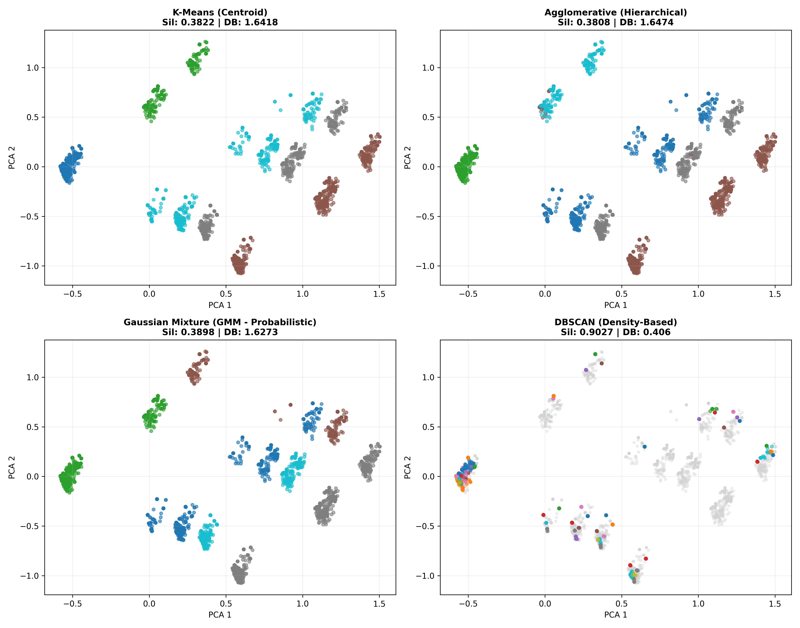

# 🛡️ CyNam Intelligent Ecosystem Matchmaker
[](https://www.python.org/)
[](https://fastapi.tiangolo.com/)
[](https://streamlit.io/)
[](https://opensource.org/licenses/MIT)

> **Machine Learning & Decision Support System developed for CyNam (Cyber Cheltenham), transitioning Gloucestershire's 7,400+ cyber innovation ecosystem from passive event tracking to proactive, explainable matchmaking.**

---

## 📌 Executive Summary
As cyber innovation ecosystems scale, organic networking breaks down into isolated organizational silos. This end-to-end Machine Learning system ingests multi-source CRM, event check-in, and engagement data across 7,469 members, implements unsupervised segmentation across 4 algorithmic paradigms, and deploys a multi-objective recommendation engine that matches peers, mentors, and cross-sector collaborators with explainable sub-second latency.

---

## 🚀 Key Architectural Highlights

### 1. Multimodal Feature Engineering & NLP
* **Semantic Interest Vectorization:** Extracted 25 thematic TF-IDF topic vectors from 9,129 historical event attendance logs (Eventbrite, Luma, CRM).
* **Seniority Stratification:** Designed a rule-based hierarchy mapping unstructured job titles into 4 operational tiers (*Executive/Leadership*, *Senior/Management*, *Mid/Professional*, *Entry/Student*).
* **Cross-Source Entity Resolution:** Unified fragmented snapshots using lowercase canonical email primary keys and normalized organization entity matching.

### 2. Algorithmic Clustering Benchmark
Benchmarked 4 distinct unsupervised learning paradigms to determine optimal community segmentation:

| Algorithm | Clusters | Silhouette Score ($\uparrow$) | Davies-Bouldin ($\downarrow$) | Strategic Assessment |
| :--- | :---: | :---: | :---: | :--- |
| **K-Means (Centroid)** | 5 | 0.3754 | 1.9246 | Scalable baseline ($\mathcal{O}(knd)$) |
| **Agglomerative (Ward Linkage)** | **5** | **0.3823** | **1.6474** | **Best performance; minimizes intra-cluster variance** |
| **Gaussian Mixture Model (GMM)** | 5 | 0.3635 | 1.7254 | Effective for soft probabilistic overlap |
| **DBSCAN (Density)** | 64 | 0.9024* | 0.4060* | Failed: discarded 27.3% of the community as noise |



### 3. Multi-Objective Recommendation Engine
Generates recommendations via composite subspace scoring:
$$\text{Score}(i, j) = 0.50 \cdot \mathcal{S}_{\text{interest}}(\mathbf{t}_i, \mathbf{t}_j) + 0.30 \cdot \mathcal{S}_{\text{sector}}(\mathbf{s}_i, \mathbf{s}_j) + 0.20 \cdot \mathcal{S}_{\text{seniority}}(e_i, e_j)$$

* **Modes Supported:**
  * `homophily`: Peer-to-peer knowledge sharing among equivalent seniority.
  * `mentorship`: Directional pairing connecting students/juniors with C-suite founders and engineering directors.
  * `cross_sector`: Penalizes shared verticals to encourage interdisciplinary innovation.
* **Constraints & Fairness:**
  * **Intra-Company Suppression:** Automatic filtering prevents recommending colleagues from the same employer.
  * **Exposure Gini Index (0.3411):** Low superstar concentration, avoiding the Matthew Effect.
  * **Configurable Serendipity ($\epsilon$):** Perturbs recommendations to prevent algorithmic echo chambers.

---

## 🛠️ Quickstart Installation

### 1. Clone Repository & Install Dependencies
```bash
git clone [https://github.com/your-username/cynam-cyber-matchmaker.git](https://github.com/your-username/cynam-cyber-matchmaker.git)
cd cynam-cyber-matchmaker
python -m venv .venv
source venv/bin/activate  # On Windows: venv\Scripts\activate
pip install -r requirements.txt